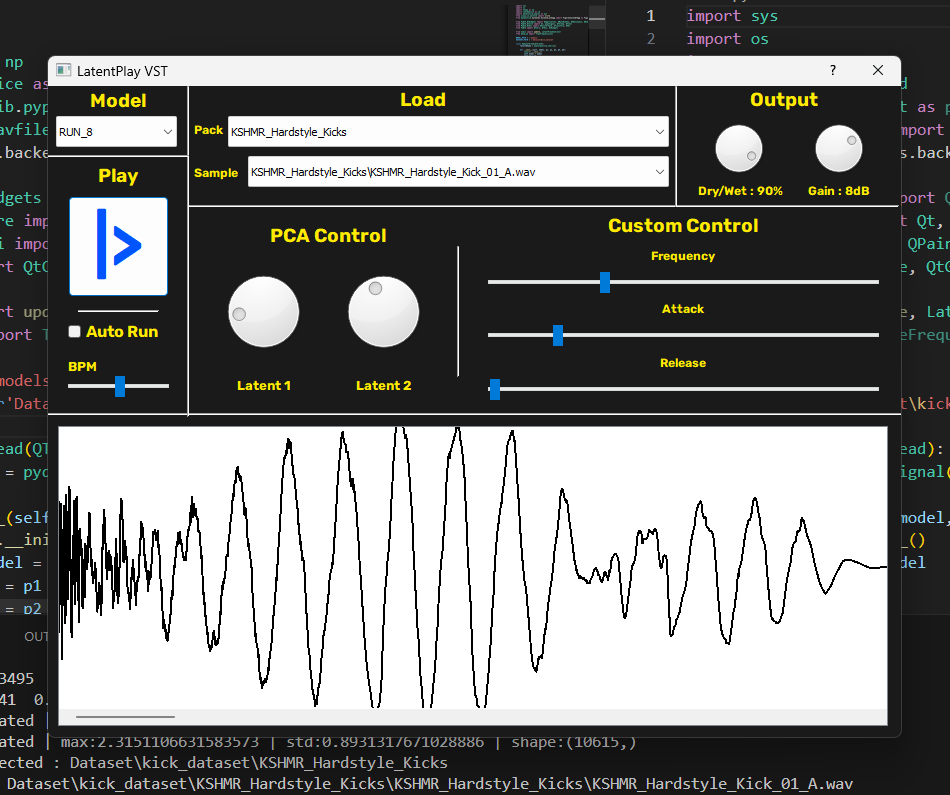
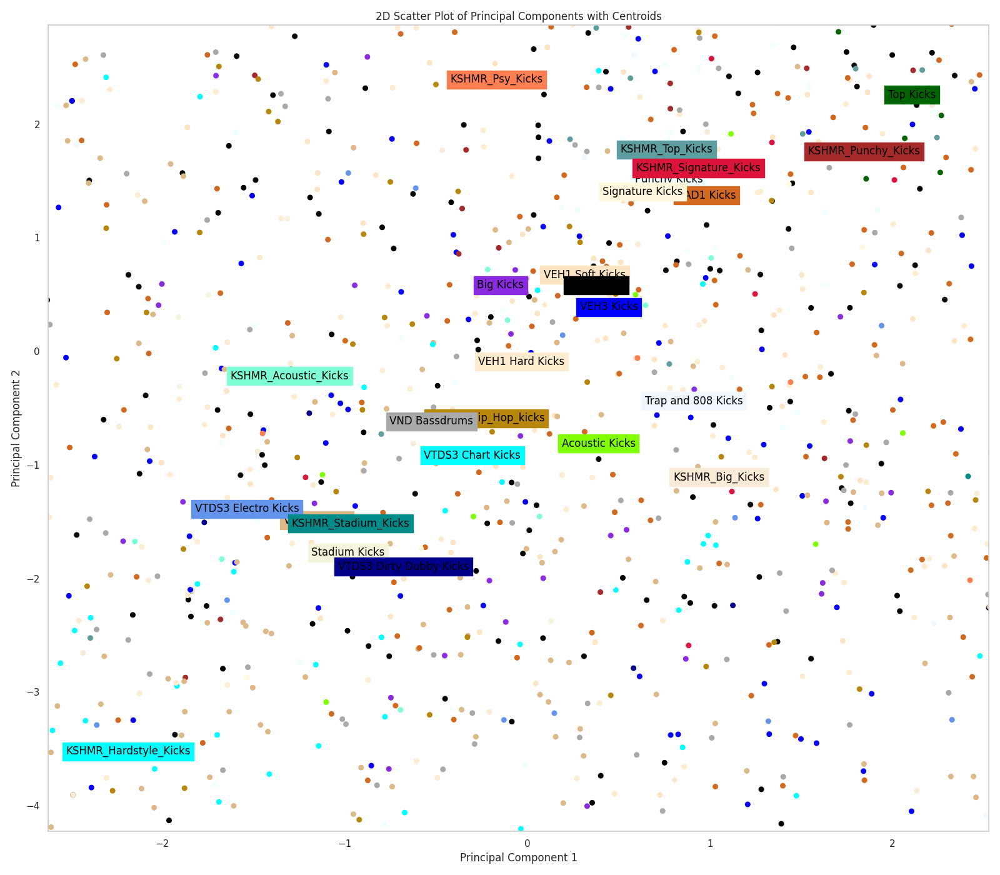
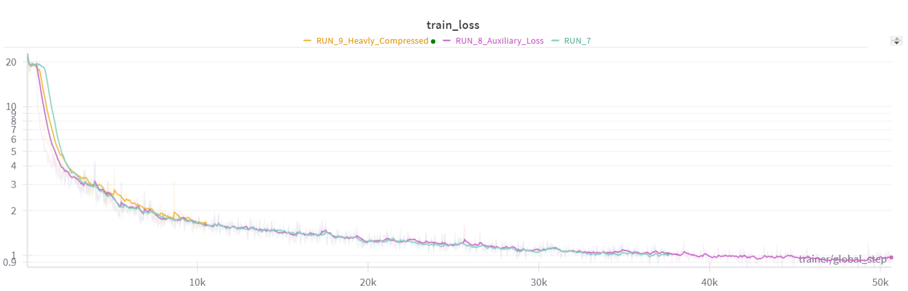
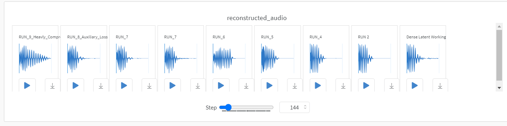
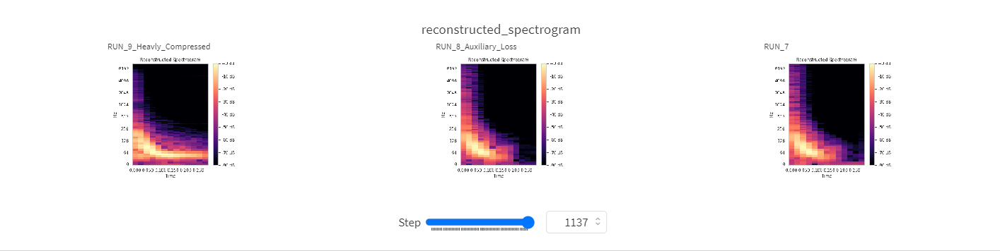

# Latent Play - VST

## -> [**YouTube Demo**](./code/Experiments_WaveShaper.ipynb) <-

[**Kaggle Code**](https://www.kaggle.com/code/adhmardesenneville/latentplay)
| [**Overview**](#Overview)
| [**Tutorial**](#Tutorial)
| [**Implementation**](#Implementation)


# Overview

**Latent Play** is a VST plugin demonstration for sample generation. It leverages neural synthesis to offer infinite control over your sample packs. This repository contains [Kaggle](https://www.kaggle.com/code/adhmardesenneville/latentplay/output?scriptVersionId=188128696) code utilizing [PyTorch Lightning](https://lightning.ai/docs/pytorch/stable/) and [Weights & Biases (WandB)](https://wandb.ai/site) for the training pipeline, along with [PyQt5](https://pypi.org/project/PyQt5/) for the graphical user interface (GUI).




### How It Works
Follow these steps to harness the capabilities of the Latent Play VST:

1. **Select Sample Packs:** Choose a list of sample packs you wish to train your model on. For instance, you could select all your kick sample packs you have.
2. **Train the Model:** Train the model using your selected sample packs.
3. **Load the VST:** Import your newly trained model into the VST.
4. **Load a Sample:** Load the specific sample you want to manipulate.
5. **Interactive Controls:** Utilize the PCA and custom controls to explore infinite variations of your sample and achieve artistic control.


# Tutorial

## 1 - Dataset
To prepare your dataset, organize it in the following simple structure:

```
Dataset
├── Pack 1
│   ├── Audio_1.wav
│   └── Audio_e.wav
├── Pack 2
│   ├── SubPack 1
│   │   ├── Audio_r.wav
│   │   └── Audio_X.wav
│   ├── SubPack 2
│   │   └── Audio_F.wav
├── Pack 3
...
```

Organizing your samples into separate packs simplifies the process of selecting samples within the plugin. It also facilitates the analysis of how each pack clusters in the latent space.




## 2 - Training
Adjust the configuration to suit your needs. Modify parameters such as sample duration, the number of layers in the autoencoder to optimize inference speed, training hardware, and training duration, etc...

Launch the training script and track progress using the WandB API. You also have access to audio samples generated by your model during training to evaluate audio quality.





## 3 - Run the VST
Place the output file from the training session into the models folder:
```
MODEL_PATH = ...
```
Store your dataset in the dataset folder:
```
DATASET_PATH = ...
```
To run the application, execute the following command:
```
python GUI/main.py
```
## 4 - Play with Latent space !!

# Implementation

## Latent Space Modification

This part of the project was intentionally developed without reference to existing literature or popular techniques, fostering more creative thinking. It's possible that the techniques discussed here are either trivial or non-existent in the literature.

Let $z$ represent the latent space. Our objective is to modify this space $z \rightarrow z'$ in a meaningful way to control five parameters:

1. $\lambda _1' = \langle z', w_{(1)} \rangle$: The projection of $z'$ onto the first principal component.
2. $\lambda _2' = \langle z', w_{(2)} \rangle$: The projection of $z'$ onto the second principal component.
3. $f' = \langle z', \theta_{\text{f}} \rangle$: Estimated audio frequency from the latent space.
4. $\alpha' = \langle z', \theta_{\alpha} \rangle$: Estimated audio attack from the latent space.
5. $\beta' = \langle z', \theta_{\beta} \rangle$: Estimated audio release from the latent space.

These constraints can be conveniently expressed as a linear matrix equality $Az' = b$, where:
```math
A = 
\begin{bmatrix}
 & - - - & w_1 & - - - & \\
 & - - - & w_2 & - - - & \\
 & - - - & \theta_{\rho} & - - - & \\
 & - - - & \theta_{\alpha} & - - - & \\
 & - - - & \theta_{\beta} & - - - & \\
\end{bmatrix}, b' = \begin{bmatrix}
 & \lambda'_1& \\
 & \lambda'_2& \\
 & f' & \\
 & \alpha'& \\
 & \beta' & \\
\end{bmatrix}
```

We also want $z'$ to be 'close' to $z$ in the latent space, measured by the L2 norm $\|z - z'\|^2$. Thus, the new point $z'$ must solve:

```math
\begin{aligned}
    & \underset{z'}{\text{minimize}}
    & & \|z - z'\|^2 \\
    & \text{subject to}
    & & Az' = b'
\end{aligned}
```

This forms a classical convex optimization problem. The analytical solution is:
```math
z' = z + A^T (A A^T)^{-1} (b' - Az)
```
This formulation allows for precise manipulation of the latent space, ensuring that modifications to the audio characteristics are both intentional and controlled.

## Model

The model is an autoencoder composed of an encoder ResNet with 1D convolution layers and a dense layer for the encoder. The decoder features a dense layer followed by a ResNet with 1D deconvolution layers. Typically, experiments are conducted with a total of 50 layers (25 per encoder and decoder) and approximately 5 million parameters.

This model is not a variational autoencoder (VAE) for several reasons:
- It allows for direct loading of samples from your sample pack into the VST plugin by selecting the corresponding point in the latent space.
- It provides better reconstruction quality.

However, it would be interesting to explore the impact of using a VAE on the model's performance and capabilities. (especially custom feature control)

## Loss

The initial experiments using MSE (Mean Squared Error) temporal loss resulted in high-frequency artifacts and overall poor quality. Consequently, we adopted a multi-time-frequency loss from the paper [auraloss: Audio-focused loss functions](https://static1.squarespace.com/static/5554d97de4b0ee3b50a3ad52/t/5fb1e9031c7089551a30c2e4/1605495044128/DMRN15__auraloss__Audio_focused_loss_functions_in_PyTorch.pdf). By utilizing the time-frequency multi-resolution loss, the results significantly improved.

Another encountered issue was poor control over custom features. To address this, an auxiliary loss was introduced to encourage the latent space to accurately predict custom features using a linear transformation (layer). The weight of this loss is controlled by $\beta$.

Furthermore, in the neural synthesis of kick sounds, the attack phase (first 0.05 seconds) is crucial in human evaluations. To enhance the perceived quality of the attack, a weighted loss with higher emphasis at the beginning of each audio sample was implemented. This was achieved using a multiplier envelope parameterized as $e(t) = 1 + Ke^{-\frac{t}{\tau}}$.

The final loss expression is:
```math
L(x,x_{hat},f,f_{hat}) = AURA_{loss}(xe(t),x_{hat}e(t)) + \alpha \|xe(t) - x_{hat}e(t)\|^2 + \beta \|f - f_{hat}\|^2 
```

| Loss Config |       |
|-------------|---------------|
| $\alpha$    | 100           |
| $\beta$     | 20            |
| K           | 5             |
| $\tau$      | 0.1           |


## Training Config
Here is the training config:

| Data Config       |                           |
|-----------|-----------------------------------|
| duration  | 0.3                               |
| fade_out  | 0.1                               |
| sr        | 22050                             |
| batch_size           | 32                     |

| Model Config      |                          |
|-------------------|--------------------------|
| channels          | 64                       |
| compression_rate  | 0.03                     |
| factors           | 4, 4, 4, 4, 4            |
| in_channels       | 1                        |
| multipliers       | 1, 2, 2, 2, 2, 1         |
| num_blocks        | 5, 5, 5, 5, 5            |

| Training Config      |                        |
|----------------------|------------------------|
| epoch                | 800                    |
| epoch_min            | 50                     |
| patience             | 100                    |
| lr                   | 0.0001                 |
| num_workers          | 3                      |
| hardware             | P100                   |
| machine              | Kaggle                 |


## Ethical Concerns

Unfortunately, the model has been trained on private, paid sample packs. Neither the dataset nor the output model can be shared from my experiments. This is particularly critical since the model's decoder weights, combined with knowledge of latent space points, are capable of reproducing the entire private dataset with high quality.

It is interesting to see that we built a compressed representation of the dataset.

- $\text{DatasetSize} = \text{NbAudio} \times \text{Duration} \times \text{SampleRate}$
- $\text{CompressedSize} = \text{Nb\_audio} \times \text{LatentSpace\_Size} + \text{NbDecoderParameters}$

In one of my experiments, we get:

- $\text{DatasetSize} = 2,448 \times 0.3 \times 22,050 \approx 16.2 \text{M floats}$
- $\text{CompressedSize} = 2,448 \times 19 + 2,818,828 \approx 2.9 \text{M floats}$

This gives a compression rate of approximately 6.

## To Do

- Implement a VAE (Variational Autoencoder) model.
- Develop a real VST (Virtual Studio Technology) implementation.
- Explore and implement other model architectures.
- Learn latent space temporal dynamics using LSTM (Long Short-Term Memory) networks, and ensure compatibility with any sample size.
- Improve custom feature control.

# 
- Tonal and saturated, 
- subi / no sub
- Long tale - short transient
- Punch at the start
- top clip
- High ends
- Transient part - boby part - tail
- Sine sweep
- Dry (ne reverb) vs wet
- Round vs dirty
